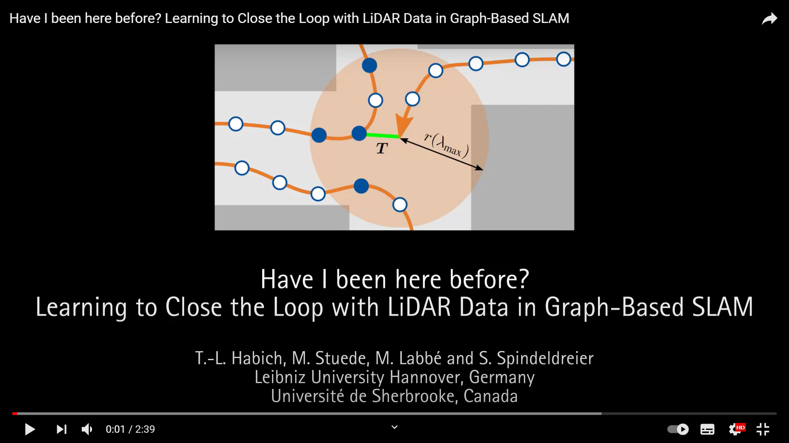

# cmr_lidarloop

This is a ROS package to close loops with LiDAR data. It was developed to extend graph-based SLAM methods in which laser scans are only marginally used for loop detection.
The code is part of a conference paper submitted for publication at AIM 2021. You can find a [detailed description of cmr_lidarloop](https://marvinstuede.github.io/Sobi/software/lidarloop.html) in the documentation of our robot Sobi.

<p align="center">
  <a href="https://www.youtube.com/watch?v=Co81uQPXvn8" />
    
  </a>
</p>

## Table of Contents

* [Getting Started](#getting-started)
* [Usage](#usage)
  * [Standalone for Training and Testing of Detectors](#standalone-for-training-and-testing-of-detectors)
  * [Standalone for Scan Registration](#stangdalone-for-scan-registration)
  * [Single- and Multi-Session Operation with RTAB-Map](#single--and-multi-session-operation-with-rtab-map)
* [Contact](#contact)

## Getting Started
Since cmr_lidarloop was introduced as an extension of the online SLAM library RTAB-Map, the corresponding ROS package with all necessary dependencies must also be installed.
Therefore, to use the package the following prerequisites must be met:

* [ROS](http://wiki.ros.org/ROS/Installation) - Currently tested with __kinetic__, __melodic__ and __noetic__
* [Configured ROS Environment](http://wiki.ros.org/ROS/Tutorials/InstallingandConfiguringROSEnvironment) - ROS workspace created
* [RTAB-Map](http://github.com/introlab/rtabmap_ros/) - RTAB-Map installation. Currently tested with RTAB-Map version __0.20.16__

The package was mainly developed with the following libraries in the given version.
However, newer versions, e.g. installed by rosdep, should work as well.
| Dependency     | Version |
| ----------- | ----------- |
| scikit-learn | 0.20.1|
| scipy| 0.13.3|
| numpy| 1.11.0|

Install cmr_lidarloop in your catkin workspace:
```
$ cd ~/catkin_ws
$ git clone https://github.com/MarvinStuede/cmr_lidarloop.git src/cmr_lidarloop
$ rosdep update
$ rosdep install cmr_lidarloop
$ catkin build
```

## Usage
The package has been fully implemented for both single- and multi-session operation into the RTAB-Map framework.
This is realized by performing loop search and scan registration in parallel threads.
RTAB-Map provides cmr_lidarloop permanently with the current data of the map and receives the LiDAR data, which consists of a point cloud with the corresponding scan descriptor.
For this purpose, cmr_lidarloop processes the point clouds from the laser scanner.
Furthermore, the current inaccuracy of the robot position is updated with the odometry data. The ROS package additionally contains two standalone environments.
In one environment the user can train and extensively test detectors, whereas the other environment can be used for the validation of the scan registration.

<p align="center">
  
</p>

### Standalone for Training and Testing of Detectors
To train and test a detector, the first step is to collect data. This raw data consists of robot positions with associated features of each scan.
With
```
$ roslaunch cmr_lidarloop save_detector_data.launch
```
the node for saving the detector data can be started (Wait until: [INFO][..]: Please start RTAB-Map.). After the ROSbag has played completely
(or the robot has driven the desired path), the node can be terminated, whereby the detector data (~/.ros/raw_detector_data.csv) are automatically saved.
Once the detector data have been successfully generated, these data can either be used to train new loop detectors or to test existing classifiers.
For training, the detector data must be moved to the training directory (detector/training) and
```
$ python train_the_detector.py raw_detector_data.csv
```
must be executed. The detector trained by us (detector/training/LiDAR_Loopdetector_pythonX.pickle) is used in cmr_lidarloop operation. It can be replaced by other trained detectors.
In contrast to the training, the data must be moved to the test directory (detector/test) for testing existing detectors and
```
$ python test_the_detector.py raw_detector_data.csv
```
must be executed.

### Standalone for Scan Registration
As a second independent environment of cmr_lidarloop, the user is provided with a comprehensive validation (src/Registration_Test) of the used scan registration.
In the actual cmr_lidarloop operation it is possible to save all point clouds of added loop pairs (see parameter path_clouds).
If the registration should be executed again afterwards to visualize the registration or to optimize registration parameters, this can be done with the standalone:
```
$ ./registration_test.cpp <PATH_FOLDER> <ID_CLOUD_1> <ID_CLOUD_2> <SKY_DIRECTION>
```
This allows to visualize e.g. the start of the registration with the two unaligned point clouds, the result of the initial alignment
or the result of the final registration using Iterative Closest Point with initial guess. Furthermore, normal vectors of point clouds or outlier rejection by RANSAC can be visualized.

### Single- and Multi-Session Operation with RTAB-Map
In both single- and multi-session operation, LiDAR data is used in both modes of RTAB-Map (mapping vs. localization) to close loops.
If a database (~/.ros/rtabmap.db) exists, cmr_lidarloop reads the data of the old session, takes over the mode of RTAB-Map and the size of the short-term-memory.
The user has the possibility to adjust the parameters of cmr_lidarloop.
For this purpose, the values in the parameter file (cfg/cmr_lidarloop_params.yaml) can be changed before executing.
All necessary nodes of cmr_lidarloop can be launched with:
```
$ roslaunch cmr_lidarloop cmr_lidarloop.launch
```
After the info _Please start RTAB-Map._ appears, RTAB-Map can be used for mapping and localization as usual.
It is important to set subscribe_scan_cloud:=false and subscribe_scan_descriptor:=true.
Thus, RTAB-Map subscribes to the scan descriptor of cmr_lidarloop, which additionally contains the pointcloud (see [here](https://github.com/MarvinStuede/cmr_localization/tree/master/cmr_localization/cfg) for our RTAB-Map parameters).
When terminating cmr_lidarloop, selected data, such as the Ids of accepted loop pairs, is saved (~/.ros/cmr_lidarloop_history.csv).

## Contact
* [Tim-Lukas Habich](https://www.imes.uni-hannover.de/de/institut/team/m-sc-tim-lukas-habich/), Leibniz University Hannover, Institute of Mechatronic Systems (tim-lukas.habich@imes.uni-hannover.de)
* [Marvin Stuede](https://www.imes.uni-hannover.de/de/institut/team/m-sc-marvin-stuede/), Leibniz University Hannover, Institute of Mechatronic Systems (marvin.stuede@imes.uni-hannover.de)
